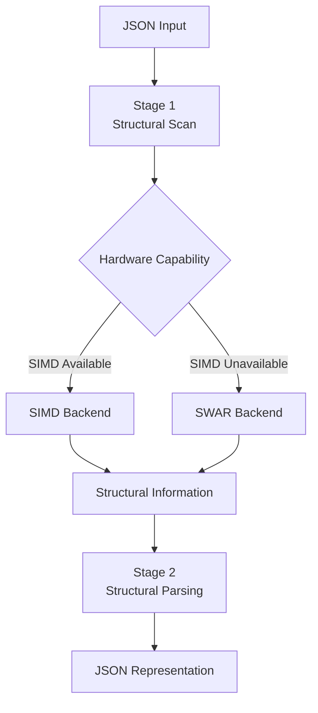
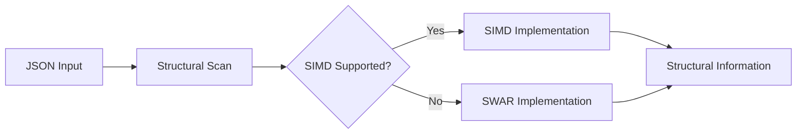
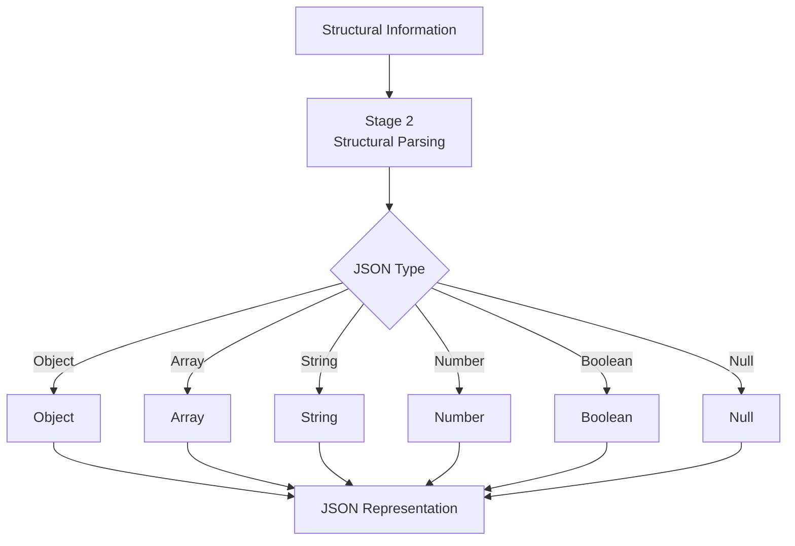
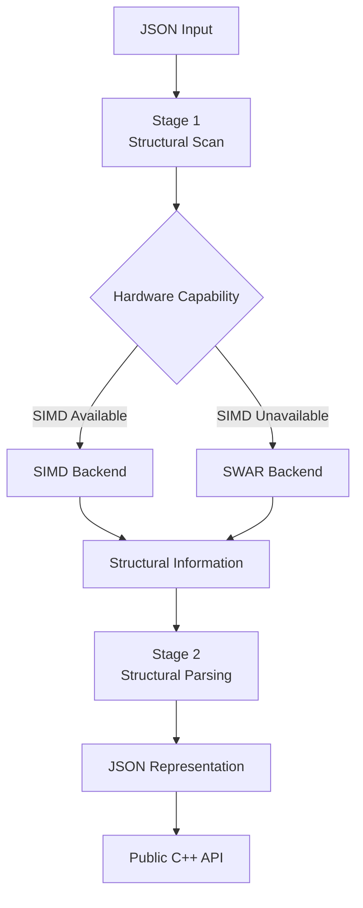
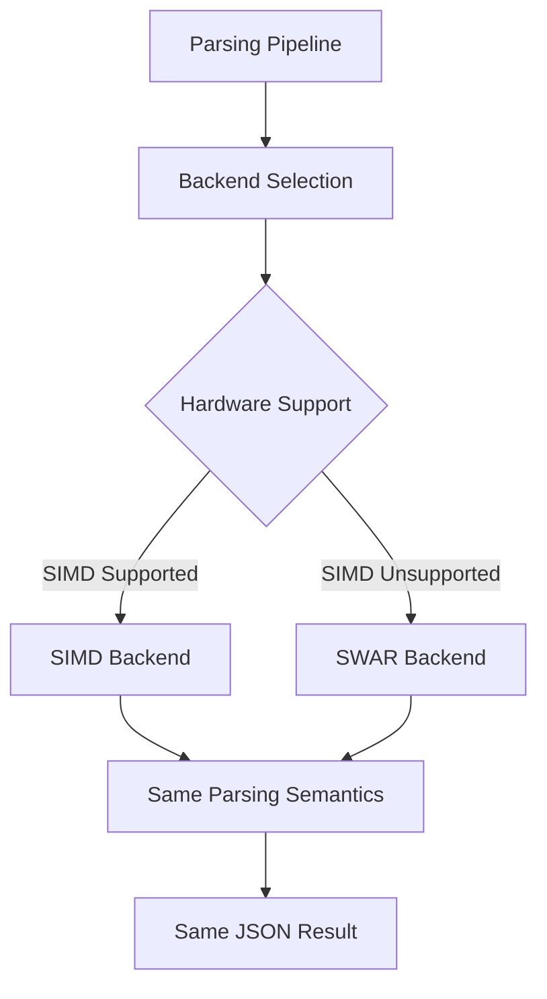
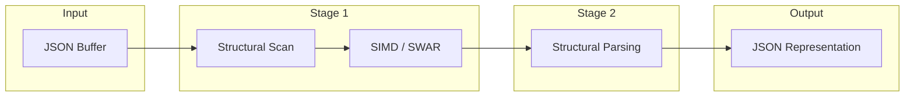

# Product Requirements Document (PRD)

## 1. Informasi Produk

| Field              | Detail     |
| ------------------ | ---------- |
| **Nama Produk**    | `zuu_json` |
| **Versi PRD**      | `v1.0.0`   |
| **Status**         | Draft      |
| **Author**         | zuudevs    |
| **Tanggal**        | 12-08-2026 |
| **Target Release** | TBD        |

---

## 2. Ringkasan Produk

### 2.1 Deskripsi

`zuu_json` adalah library JSON parser untuk C++ yang dirancang untuk menyediakan **performa parsing tinggi**, **efisiensi penggunaan memory**, dan **dukungan optimisasi berbasis hardware**.

Parser memanfaatkan SIMD apabila hardware dan instruction set yang tersedia mendukung optimisasi tersebut. Apabila SIMD tidak dapat digunakan, parser menggunakan algoritma **SWAR (SIMD Within A Register)** sebagai fallback untuk tetap mempertahankan performa parsing yang tinggi.

`zuu_json` berfokus pada proses **parsing JSON** dan tidak menyediakan fitur networking, HTTP, database, maupun komunikasi antar sistem.

### 2.2 Problem Statement

JSON banyak digunakan sebagai format pertukaran data pada aplikasi modern. Ketika aplikasi memproses JSON dalam jumlah besar atau dengan frekuensi tinggi, proses parsing dapat menjadi bagian dari computational workload yang signifikan.

`zuu_json` dikembangkan sebagai JSON parser C++ yang berfokus pada:

* latency parsing yang rendah,
* throughput tinggi,
* efisiensi memory,
* pemanfaatan kemampuan hardware,
* dan fallback yang tetap efisien ketika SIMD tidak tersedia.

### 2.3 Tujuan Produk

Produk ini bertujuan untuk:

* Menyediakan JSON parser native C++ dengan performa tinggi.
* Memanfaatkan SIMD ketika hardware mendukung instruction set yang diperlukan.
* Menyediakan fallback berbasis SWAR ketika SIMD tidak tersedia atau tidak sesuai.
* Meminimalkan overhead parsing dan penggunaan memory.
* Menyediakan API C++ yang sederhana dan konsisten.
* Menyediakan benchmark yang reproducible untuk mengevaluasi performa parser.

### 2.4 Non-Goals

`zuu_json` tidak bertujuan untuk:

* Menyediakan networking.
* Menyediakan HTTP client atau HTTP server.
* Menyediakan database atau persistent storage.
* Menyediakan JSON Schema validator.
* Menyediakan JSONPath.
* Menyediakan format data selain JSON sebagai tanggung jawab utama library.
* Menjadi framework aplikasi atau networking.

---

## 3. Target User

### 3.1 Primary User

**C++ Developer**

Developer yang membutuhkan JSON parser dengan performa tinggi untuk aplikasi C++.

### 3.2 Secondary User

**Library Developer**

Developer yang ingin menggunakan JSON parser sebagai dependency pada library atau software C++ mereka.

---

## 4. User Stories

### User Story 1

> Sebagai C++ developer, saya ingin melakukan parsing JSON menggunakan API yang sederhana, sehingga saya dapat memproses data JSON dengan mudah.

### User Story 2

> Sebagai C++ developer, saya ingin parser memanfaatkan SIMD ketika hardware mendukung, sehingga proses parsing dapat dilakukan dengan performa optimal.

### User Story 3

> Sebagai C++ developer dengan hardware yang tidak mendukung SIMD yang diperlukan, saya ingin parser memiliki fallback SWAR, sehingga parser tetap dapat berjalan dengan algoritma yang efisien.

### User Story 4

> Sebagai developer aplikasi yang membutuhkan performa tinggi, saya ingin dapat membandingkan performa tokenizer dan parser melalui benchmark, sehingga saya dapat mengevaluasi performa `zuu_json`.

---

## 5. Functional Requirements

### FR-001 — JSON Parsing

**Deskripsi:**

Library harus mampu melakukan parsing terhadap JSON yang valid sesuai grammar JSON yang didukung.

**Input:**

* JSON string.
* JSON byte buffer.

**Output:**

* Representasi JSON value/document.
* Informasi error ketika parsing gagal.

**Acceptance Criteria:**

* [ ] Object dapat diparsing.
* [ ] Array dapat diparsing.
* [ ] String dapat diparsing.
* [ ] Number dapat diparsing.
* [ ] Boolean dapat diparsing.
* [ ] `null` dapat diparsing.
* [ ] Invalid JSON dapat dideteksi.

---

### FR-002 — SIMD Acceleration

**Deskripsi:**

Parser harus dapat menggunakan SIMD pada hardware yang menyediakan instruction set yang diperlukan oleh implementasi.

SIMD digunakan sebagai jalur optimisasi untuk operasi parsing yang sesuai.

**Acceptance Criteria:**

* [ ] Parser dapat mendeteksi atau memilih implementation path SIMD yang sesuai.
* [ ] SIMD hanya digunakan apabila hardware mendukung.
* [ ] Hasil parsing SIMD identik dengan implementation path lainnya.
* [ ] Penggunaan SIMD tidak menjadi requirement agar library dapat digunakan.

---

### FR-003 — SWAR Fallback

**Deskripsi:**

Apabila hardware tidak mendukung SIMD yang diperlukan, parser harus menggunakan algoritma **SWAR (SIMD Within A Register)** sebagai fallback.

SWAR menjadi jalur alternatif untuk tetap melakukan optimisasi pada hardware yang tidak memenuhi requirement SIMD.

**Acceptance Criteria:**

* [ ] Parser dapat berjalan tanpa SIMD.
* [ ] Parser menggunakan implementation path berbasis SWAR sebagai fallback.
* [ ] Hasil parsing SWAR identik dengan hasil parsing SIMD.
* [ ] Fallback tidak memerlukan perubahan pada public API.
* [ ] SWAR path dapat diuji dan di-benchmark secara independen.

---

### FR-004 — Error Handling

**Deskripsi:**

Parser harus menyediakan mekanisme untuk mendeteksi dan melaporkan input JSON yang invalid.

**Acceptance Criteria:**

* [ ] Invalid syntax dapat dideteksi.
* [ ] Parsing error dapat dikembalikan kepada caller.
* [ ] Error handling tidak menyebabkan undefined behavior.
* [ ] Informasi error cukup untuk membantu debugging.

---

### FR-005 — JSON Value Access

**Deskripsi:**

Hasil parsing harus dapat diakses melalui public C++ API.

**Acceptance Criteria:**

* [ ] Object dapat diakses berdasarkan key.
* [ ] Array dapat diakses berdasarkan index.
* [ ] Type JSON dapat diperiksa.
* [ ] Primitive value dapat diambil.
* [ ] Nested JSON dapat diakses.

---

## 6. Non-Functional Requirements

### Performance

* Parser harus dioptimalkan untuk latency rendah dan throughput tinggi.
* SIMD digunakan apabila hardware mendukung.
* SWAR digunakan sebagai fallback apabila SIMD tidak tersedia.
* Tokenizer dan parser harus dapat diukur melalui benchmark.
* Performance regression harus dapat terdeteksi melalui benchmark.

### Memory Efficiency

* Parser harus meminimalkan allocation yang tidak diperlukan.
* Copy data yang tidak diperlukan harus dihindari apabila memungkinkan.
* Memory usage harus dapat dianalisis melalui profiling atau benchmark.

### Reliability

* Parser harus menghasilkan hasil yang deterministik untuk input yang sama.
* Invalid input tidak boleh menyebabkan crash atau undefined behavior.
* Regression test harus dipertahankan.

### Portability

Library harus dapat digunakan pada platform yang didukung oleh compiler dan architecture target.

Target awal:

* Windows
* Linux
* macOS

### Language & Build Compatibility

* Language Standard: C++23
* Build System: CMake
* Compiler: Clang, GCC, MSVC
* Testing: GoogleTest
* Benchmarking: Google Benchmark
* Fuzzing: LLVM libFuzzer

---

## 7. User Flow

### Flow: Parse JSON

1. Developer menyediakan input JSON.
2. Developer memanggil API parsing `zuu_json`.
3. Parser menentukan implementation path yang tersedia.
4. Jika hardware mendukung SIMD yang diperlukan, parser menggunakan SIMD path.
5. Jika SIMD tidak tersedia, parser menggunakan SWAR path.
6. Input ditokenisasi.
7. Token hasil tokenization diproses oleh parser.
8. Parser menghasilkan JSON value/document atau error.

**Expected Result:**

Input JSON yang valid menghasilkan representasi JSON yang dapat diakses melalui public API, sedangkan input invalid menghasilkan parsing error.

---

## 8. Data Requirements

### Entity: JSON Value

`zuu_json` harus dapat merepresentasikan JSON value berikut:

| Type      | Description                       |
| --------- | --------------------------------- |
| `null`    | JSON null value                   |
| `boolean` | `true` atau `false`               |
| `number`  | JSON number                       |
| `string`  | JSON string                       |
| `array`   | Ordered collection of JSON values |
| `object`  | Collection of key-value pairs     |

### Data Validation

* JSON syntax harus mengikuti grammar JSON yang didukung.
* String harus mengikuti aturan escaping JSON.
* Number harus mengikuti format JSON yang valid.
* Object key harus berupa string.
* Nested structure harus diproses dengan benar.

---

## 9. API Requirements

`zuu_json` merupakan **library API C++**, bukan REST API atau networking API.

Contoh konseptual:

```cpp
auto result = zuu::json::parse(input);
```

### API Requirements

* Public API harus konsisten.
* Public API harus terdokumentasi.
* Error handling harus konsisten.
* API harus menggunakan fitur C++23 secara tepat.
* Detail implementasi SIMD dan SWAR tidak boleh diwajibkan untuk diketahui oleh pengguna library.
* Pemilihan SIMD/SWAR harus bersifat transparan terhadap pengguna API.

---

## 10. UI/UX Requirements

Tidak berlaku karena `zuu_json` merupakan library dan tidak menyediakan graphical user interface.

Fokus Developer Experience:

* API sederhana.
* Dokumentasi jelas.
* Error information yang berguna.
* Contoh penggunaan.
* CMake integration yang mudah.

---

## 11. Technical Requirements

### Architecture

`zuu_json` menggunakan pendekatan **multi-stage parsing pipeline** yang terinspirasi dari arsitektur `simdjson`.

Pipeline memisahkan proses identifikasi struktur JSON dari proses parsing sehingga setiap tahap dapat dioptimalkan secara independen.



### Stage 1 — Structural Scan

Stage pertama bertanggung jawab untuk melakukan scanning terhadap input JSON dan mengidentifikasi informasi struktural yang diperlukan oleh tahap parsing berikutnya.

Informasi yang dapat diidentifikasi meliputi:

* Structural characters.
* String boundaries.
* Escape characters.
* Whitespace.
* Kandidat token atau elemen struktural lainnya.

Stage ini menggunakan SIMD apabila hardware menyediakan instruction set yang dibutuhkan.

Apabila SIMD tidak tersedia, stage menggunakan backend berbasis **SWAR**.



### Stage 2 — Structural Parsing

Stage kedua menggunakan informasi struktural yang dihasilkan Stage 1 untuk membangun representasi JSON.

Tanggung jawab tahap ini meliputi:

* Menentukan tipe JSON value.
* Memproses object.
* Memproses array.
* Memproses scalar value.
* Memproses nesting.
* Memvalidasi struktur JSON.



### Overall Parsing Pipeline



### Backend Architecture

SIMD dan SWAR bukan bagian dari public API. Keduanya merupakan implementation backend yang digunakan secara transparan oleh parsing pipeline.



### Pipeline Requirements

* [ ] Parser menggunakan multi-stage parsing pipeline.
* [ ] Stage 1 bertanggung jawab terhadap structural scanning.
* [ ] Stage 2 bertanggung jawab terhadap structural parsing.
* [ ] SIMD digunakan apabila hardware mendukung instruction set yang diperlukan.
* [ ] SWAR digunakan sebagai fallback ketika SIMD tidak tersedia.
* [ ] SIMD dan SWAR memiliki semantic behavior yang sama.
* [ ] Backend selection bersifat transparan terhadap pengguna library.
* [ ] Setiap stage dapat diuji secara independen.
* [ ] Setiap stage dapat di-benchmark secara independen.
* [ ] Full pipeline benchmark tersedia.

### Component Overview




### Core Components

* **Tokenizer** — memproses input dan menghasilkan token JSON.
* **SIMD Path** — implementation path yang memanfaatkan SIMD apabila tersedia.
* **SWAR Path** — fallback optimized path ketika SIMD tidak tersedia.
* **Parser** — membangun struktur JSON berdasarkan token.
* **Storage / JSON Value** — merepresentasikan hasil parsing.
* **Error Handling** — menangani invalid input dan parsing failure.

### Technology Stack

| Component             | Technology         |
| --------------------- | ------------------ |
| Language              | C++23              |
| Build System          | CMake              |
| Compiler              | Clang / GCC / MSVC |
| Testing               | GoogleTest         |
| Benchmark             | Google Benchmark   |
| Fuzzing               | LLVM libFuzzer     |
| Hardware Optimization | SIMD               |
| Fallback Optimization | SWAR               |

### Constraints

* SIMD hanya digunakan apabila hardware mendukung instruction set yang diperlukan.
* Library harus tetap dapat digunakan pada hardware tanpa SIMD yang diperlukan.
* SWAR harus menjadi fallback implementation yang valid.
* Pemilihan SIMD atau SWAR tidak boleh mengubah hasil parsing.
* Optimisasi tidak boleh mengorbankan correctness.
* Public API tidak boleh bergantung pada detail implementation path.

---

## 12. Success Metrics

| Metric                  | Target                                                  |
| ----------------------- | ------------------------------------------------------- |
| Parsing correctness     | Seluruh test case valid berhasil diproses               |
| Invalid input detection | Seluruh invalid test case yang didukung dapat dideteksi |
| SIMD compatibility      | SIMD digunakan pada hardware target yang mendukung      |
| Fallback compatibility  | SWAR berjalan pada hardware tanpa SIMD yang diperlukan  |
| Performance regression  | Tidak terdapat regression signifikan tanpa justifikasi  |
| Test coverage           | Seluruh komponen utama memiliki automated test          |
| Benchmark               | Benchmark tokenizer, parser, dan full pipeline tersedia |

### Performance Evaluation

Benchmark harus mencakup setidaknya:

* Tokenizer.
* Parser.
* Full parsing pipeline.
* SIMD path.
* SWAR path.
* Throughput.
* Latency.

Benchmark dapat digunakan untuk membandingkan `zuu_json` dengan JSON parser lain sebagai referensi performa.

---

## 13. Edge Cases & Error Handling

| Case                             | Expected Behavior                            |
| -------------------------------- | -------------------------------------------- |
| Empty input                      | Parsing error                                |
| Invalid JSON syntax              | Parsing error                                |
| Unterminated string              | Parsing error                                |
| Invalid escape sequence          | Parsing error                                |
| Invalid number                   | Parsing error                                |
| Unexpected end of input          | Parsing error                                |
| Deeply nested JSON               | Diproses sesuai batas implementasi           |
| Large JSON document              | Diproses tanpa crash atau undefined behavior |
| SIMD unavailable                 | Otomatis menggunakan SWAR                    |
| Unsupported SIMD instruction set | Otomatis menggunakan SWAR                    |

---

## 14. Dependencies

### Development Dependencies

* CMake
* GoogleTest
* Google Benchmark
* LLVM libFuzzer

### Runtime Dependencies

`zuu_json` harus meminimalkan runtime dependency eksternal.

---

## 15. Risks

| Risk                                          | Impact | Probability | Mitigation                                        |
| --------------------------------------------- | ------ | ----------- | ------------------------------------------------- |
| SIMD implementation terlalu platform-specific | High   | Medium      | Gunakan abstraction dan fallback SWAR             |
| SIMD menghasilkan bug parsing                 | High   | Medium      | Cross-check dengan SWAR dan comprehensive testing |
| SWAR lebih lambat dari target                 | Medium | Medium      | Benchmark dan profiling                           |
| Performance regression                        | High   | Medium      | Regression benchmark                              |
| Compiler compatibility issue                  | Medium | Low         | Multi-compiler CI                                 |
| Memory usage terlalu tinggi                   | Medium | Medium      | Profiling dan memory benchmark                    |

---

## 16. Milestones

| Milestone                        | Target | Status |
| -------------------------------- | ------ | ------ |
| Project Foundation               | v0.1.0 | [x]    |
| Core (Error, Version, Expected)  | v0.2.0 | [-]    |
| Stage 1: Structural Scan         | v0.3.0 | [ ]    |
| DOM Representation               | v0.4.0 | [ ]    |
| Stage 2: Structural Parsing      | v0.5.0 | [ ]    |
| Testing Suite                    | v0.6.0 | [ ]    |
| Benchmark Suite                  | v0.7.0 | [ ]    |
| Documentation                    | v0.10.0| [ ]    |
| `v1.0.0` Release                 | TBD    | [ ]    |

---

## 17. Acceptance Criteria

Produk dinyatakan **ready untuk release** apabila:

* [ ] Object dapat diparsing dengan benar.
* [ ] Array dapat diparsing dengan benar.
* [ ] String dapat diparsing dengan benar.
* [ ] Number dapat diparsing dengan benar.
* [ ] Boolean dan `null` dapat diparsing dengan benar.
* [ ] Invalid JSON dapat dideteksi.
* [ ] Error handling telah diuji.
* [ ] SIMD path telah diuji.
* [ ] SWAR fallback telah diuji.
* [ ] SIMD dan SWAR menghasilkan hasil parsing yang konsisten.
* [ ] Library tetap dapat digunakan tanpa SIMD.
* [ ] Unit test berhasil.
* [ ] Fuzz test berhasil tanpa critical issue.
* [ ] Benchmark tersedia.
* [ ] CMake integration berhasil.
* [ ] Public API terdokumentasi.
* [ ] Tidak terdapat critical bug.

---

## 18. Out of Scope

Fitur berikut tidak termasuk dalam scope `zuu_json`:

* Networking.
* HTTP client/server.
* Database integration.
* JSON Schema validation.
* JSONPath.
* JSON Pointer.
* YAML parser.
* XML parser.
* Binary JSON format.
* Serialization apabila belum menjadi requirement release.
* Streaming parser apabila belum menjadi requirement release.

---

## 19. Open Questions

* [ ] Apakah `zuu_json` akan mendukung serialization selain parsing?
* [ ] Architecture SIMD apa saja yang akan menjadi target utama?
* [ ] Bagaimana mekanisme pemilihan SIMD dan SWAR akan diimplementasikan?
* [ ] Apakah parser akan mendukung zero-copy string?
* [ ] Bagaimana strategi memory allocation?
* [ ] Apakah API error handling akan menggunakan error code, exception, atau `std::expected`?
* [ ] Berapa target minimum throughput dan latency?
* [ ] Compiler version minimum yang akan didukung?
* [ ] Apakah streaming/incremental parsing akan masuk release berikutnya?

---

## 20. Change Log

| Version | Date       | Author  | Changes     |
| ------- | ---------- | ------- | ----------- |
| `1.0.0` | 12-08-2026 | zuudevs | Initial PRD |
